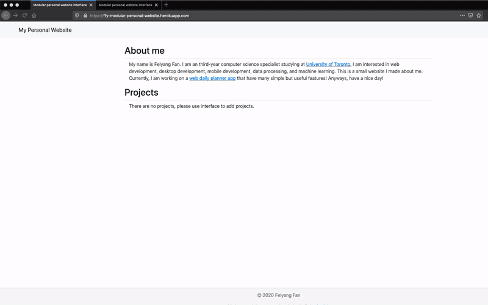

## My Modular personal website

This is a modular personal website that allow me to 
add/delete new information in a modular way. I was inspired to build this app when I was building my personal website. I feel like it is not efficient to add new codes every time I need to add a finished project on my personal website, therefore, I built this app that has an interface thats allow me to enter information, and automatically translate the information into a personal website.

## Features
* Allow users to modify their personal website in a modular way
* Allow users to add/delete projects
* Easy to navigate and manage

## Future updates
* Add user authentification system that allows only me to access the interface tool
* Add other modifiable information block such as about-me, courses table, etc..

## How to use
My website is hosted on heroku, [Link](https://ffy-modular-personal-website.herokuapp.com/)

**Add/delete projects Demo**
