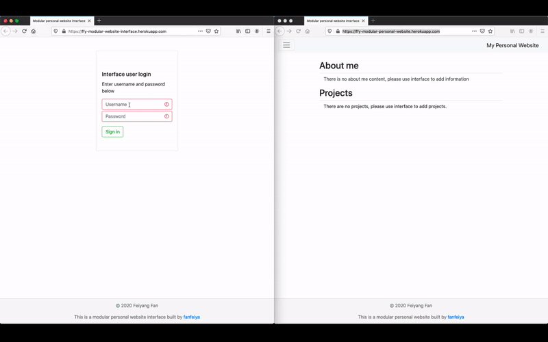
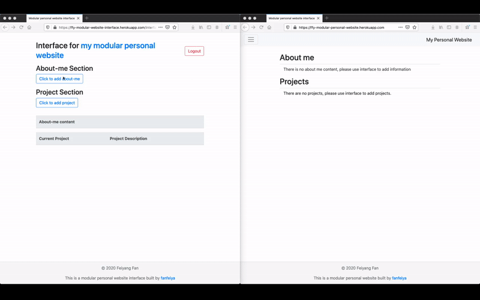
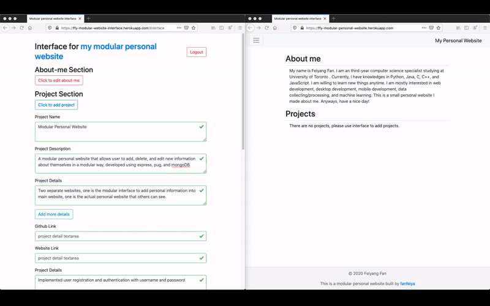
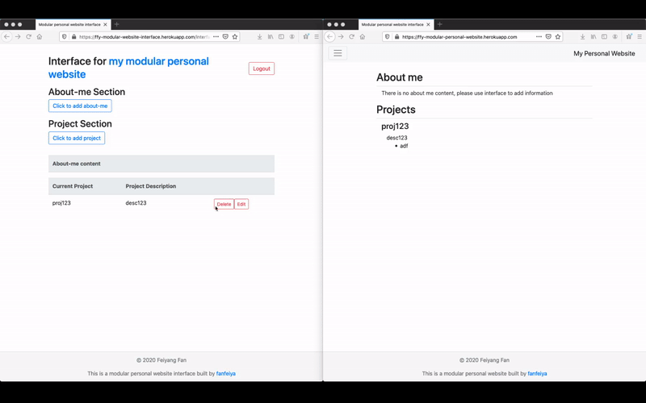
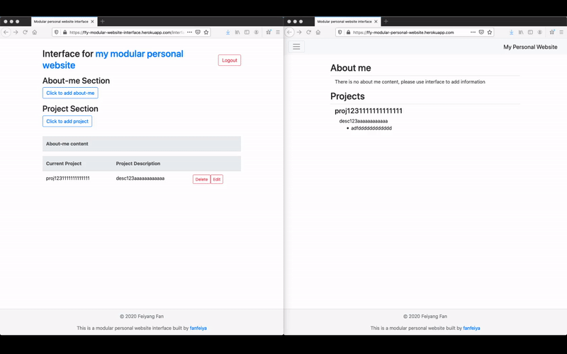
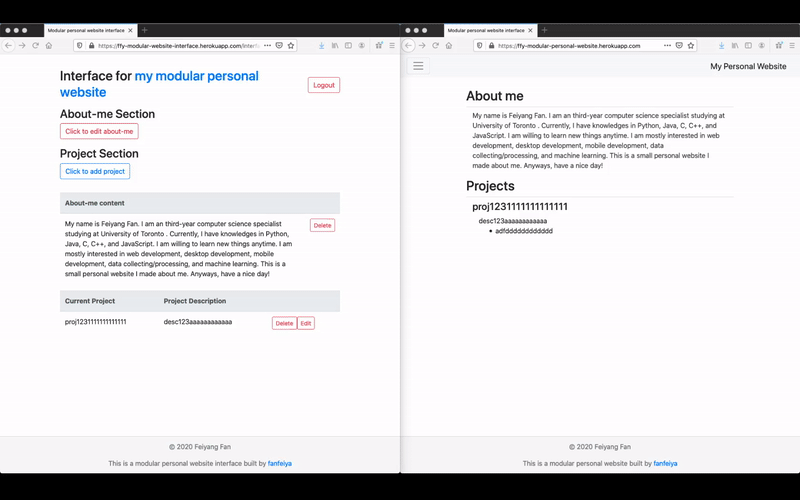
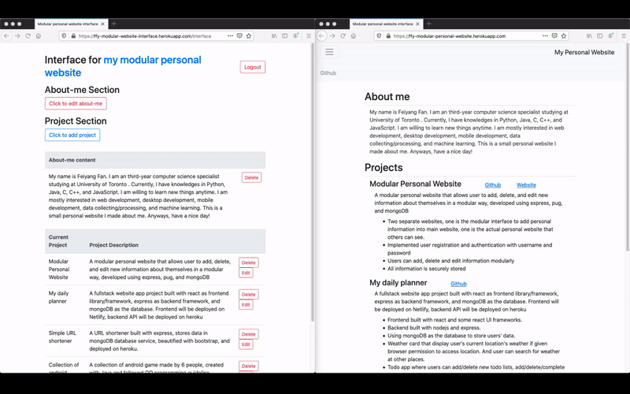

## Modular Personal Website

This is a modular personal website that allow me to 
add/delete/edit information in a modular way. Details see below.

## Inspiration
I was inspired to build this app when I was building my personal website. I feel like it is not efficient to directly modify the website's codes every time I need to change something. Therefore, I built this app that has an interface thats allow me to change information, and automatically translate the information changed into a modern and responsive personal website.

## Features
* Provided a seperate user interface website that has:
	* User login system using username and password
	* Allow users to modify their personal website in a modular way
		* Allow users to add/delete/edit projects including: name, description, details in list form, github link, and website link.
		* Allow users to add/delete/edit about me content.
	* Easy to navigate and manage
	* Tables of previously added information
	* Easy to expand if want to add more modules (e.g. courses table, hobbies gallery...) into the website
* Generated a Modern, beautiful and responsive website.

## How to use
Website built with this tool is hosted on heroku, [Link](https://ffy-modular-personal-website.herokuapp.com/)

**Login, protected routes Demo**

**Add/Delete project Demo**

**Add project links Demo**

**Edit project Demo**

**Add/Delete about me Demo**

**Edit about me Demo**

**Finished product Demo**

